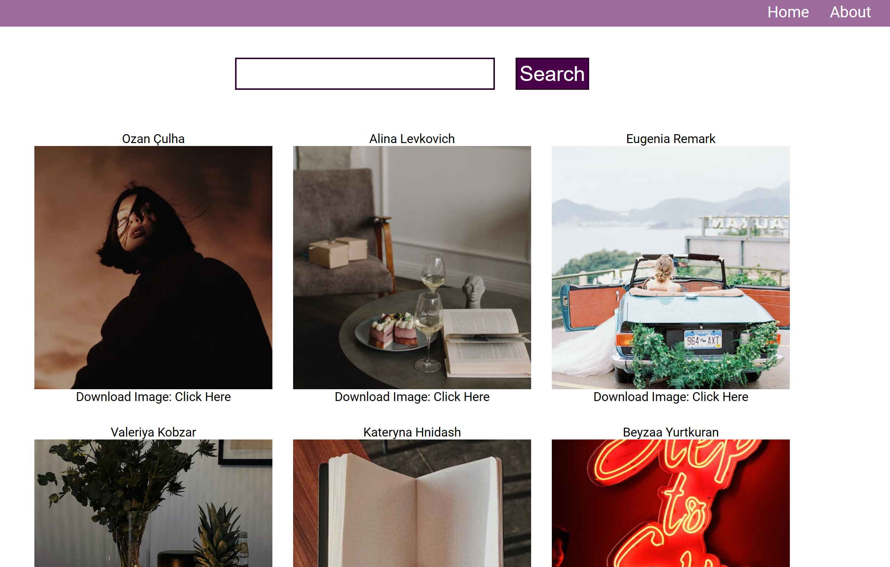
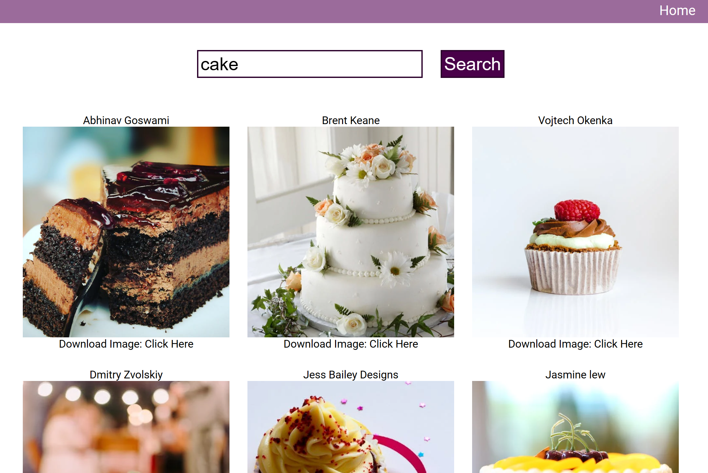

# Getting Started with Create React App

This project was bootstrapped with [Create React App](https://github.com/facebook/create-react-app). Please download React at the begining. And scss compiler is needed for generate css file in the ./src/styles folder.

The dependecies of this app are listed in package.json. Install packages by node or yarn.

# Home Page

The home page is composed of one searching form and searching results. The Pixels API is utilized as image sources.

In the form, you can get a certain topic of images by inputting key words, which you may refer to https://www.pexels.com/discover/. Default pages can only contain 15 images. If more are expected, please click "Load More" button at the bottom.

